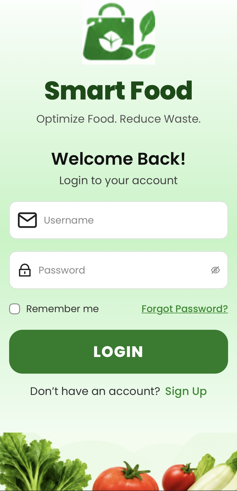
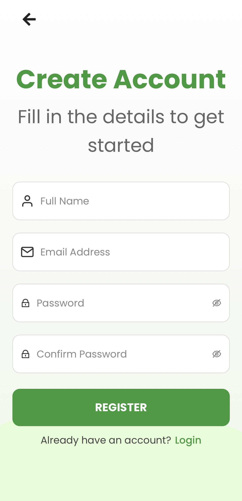
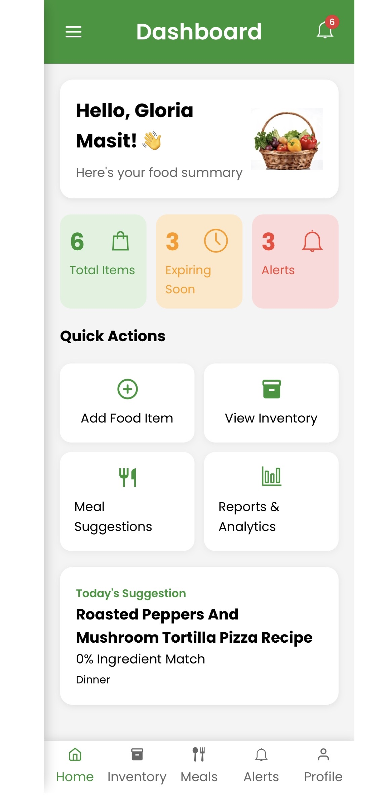
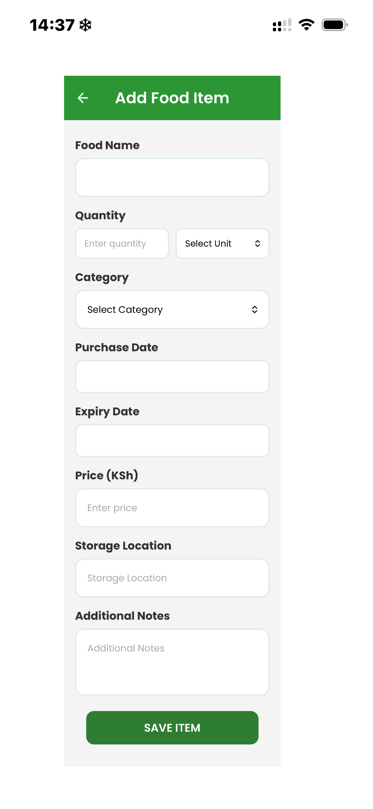
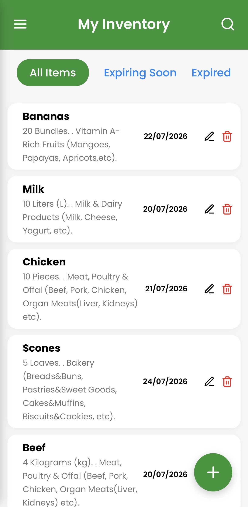
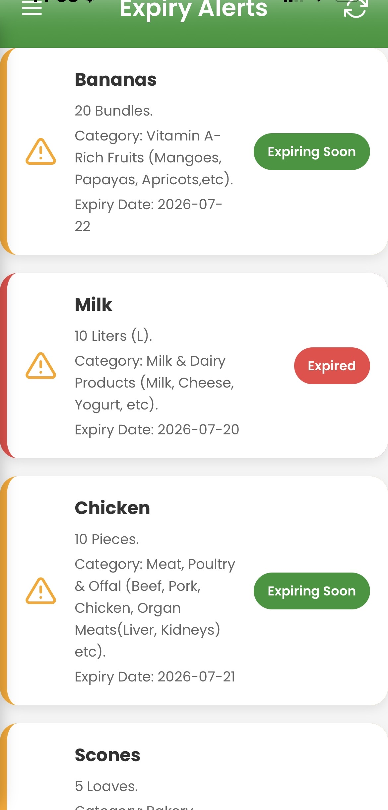
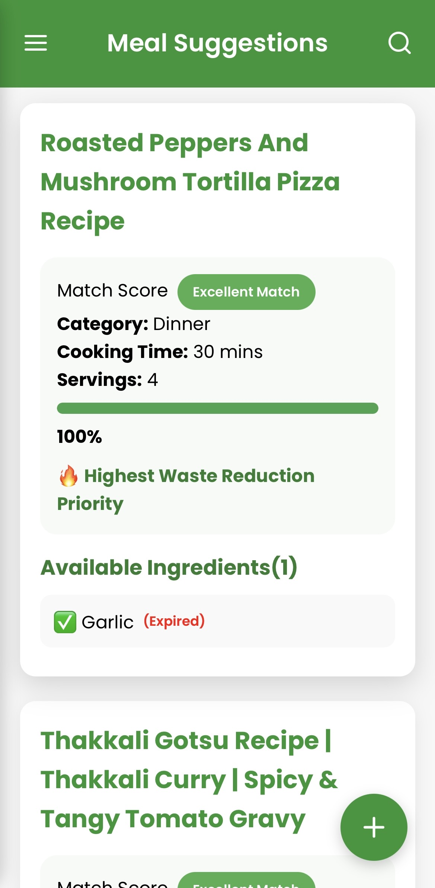
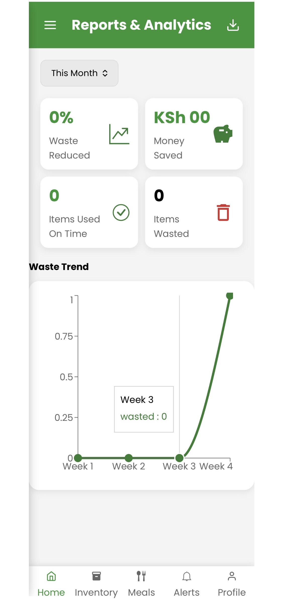
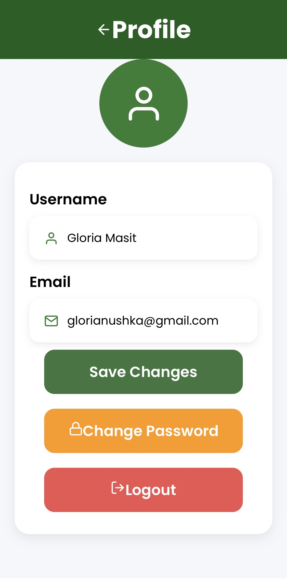

# Smart Food Optimization and Waste Reduction System (Frontend).
## Overview.
The Smart Food Optimization and Waste Reduction System is a mobile and web-based application developed to help households reduce food waste through efficient food inventory management. The system enables users to keep track of food items, monitor expiry dates, receive expiry alerts and obtain meal suggestions based on ingredients available in their inventory.

This repository contains the **React frontend**, which provides the graphical user interface (GUI) that users interact with.

## Project Objectives.
The objectives of the system are to:
* Reduce household food waste.
* Improve food inventory management.
* Monitor food expiry dates.
* Recommend meals based on available ingredients.
* Encourage better food utilization through timely alerts.

## Features.
### User Authentication.
* User Registration.
* Secure User Login.
* JWT Authentication.
* User Logout.

### Dashboard.
* Displays total food items.
* Displays expired food.
* Displays food expiring soon.
* Provides quick navigation to other modules.

### Food Inventory.
* Add new food items.
* View food inventory.
* Edit food items.
* Delete food items.
* Search food items.

### Expiry Alerts.
* Shows expired food.
* Shows food nearing expiry.
* Helps users prioritize food consumption.

### Meal Suggestions.
* Generates recipes based on ingredients available in inventory.
* Calculates ingredient match percentage.
* Highlights missing ingredients.
* Prioritizes recipes that reduce food waste.

### User Profile.
* View profile information.
* Update account details.

## Technologies Used.
### Frontend Framework.
* React.js

### Routing.
* React Router DOM.

### Styling.
* CSS3.

### Icons.
* React Icons.

### API Communication.
* Fetch API.

## Project Structure.
frontend/

├── public/
├── src/
│   ├── assets/
│   ├── components/
│   ├── pages/
│   ├── styles/
│   ├── App.js
│   └── index.js
│
├── package.json
├── package-lock.json
└── README.md

## Installation.
Clone the repository.
git clone https://github.com/Gloriajebet/smart-food-frontend.git

Navigate into the project.
cd frontend

Install dependencies.
npm install

Run the application.
npm start

The application will start on:
http://localhost:3000

## Deployment.
The frontend is deployed on **Vercel**.

Live Application.
https://smart-food-frontend-xi.vercel.app

## Backend.
The backend source code is available at:
https://github.com/Gloriajebet/smart-food-backend.git

## Screenshots.
## Login Page.

## Register Page.

## Dashboard Page.

## Add Food Page.

## Inventory Page.

## Alerts Page.

## Meal Suggestions Page.

## Reports Page.

## Profile Page.

## Author.
**Gloria Masit.**
Bachelor of Science in Software Engineering.
Senior Project.

## Acknowledgements.
Kaggle Recipe Dataset.
React.
Django REST Framework.
Railway.
Render.
Vercel.

## License.
This project was developed for academic purposes as part of a Bachelor of Science in Software Engineering final-year project.
